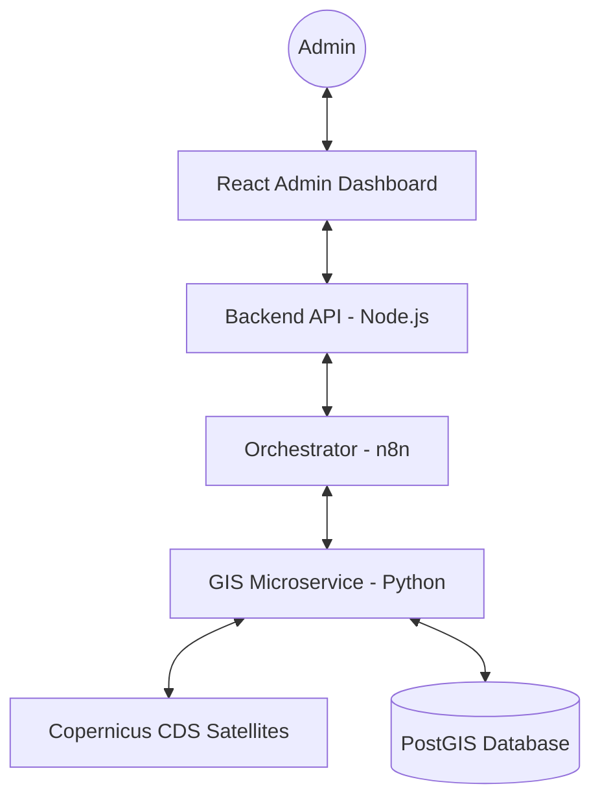

# 🛰️ Risk Prediction Engine (Agentic AI)

A professional, high-performance **Disaster Risk Prediction Platform** featuring autonomous Agentic AI, real-time 3D GIS visualization, and ERA5 weather data integration.

---

## 🤖 AI Agentic Architecture
The system is powered by an autonomous pipeline that manages the entire lifecycle of risk assessment:

1.  **Orchestrator Agent**: Manages task queuing and cross-service synchronization via **n8n**.
2.  **Data Ingestion Agent**: Automatically fetches real-time ERA5 weather data from Copernicus satellites.
3.  **GIS Mapping Agent**: Dynamically generates risk maps by overlaying satellite data with static susceptibility models.
4.  **ML Prediction Agent** (Discovery Mode): Analyzes spatial patterns to predict potential damage.
5.  **Alert Dispatch Agent** (Beta): Autonomous multi-channel notification system.

---

## ✨ Key Features

- **🦾 Autonomous Pipeline**: 100% self-healing orchestration with Live Log terminal.
- **🔭 3D Terrain Visualization**: Interactive 3D maps powered by Three.js and Leaflet.
- **🛰️ Satellite Data Ingestion**: Automated download and processing of ERA5 rainfall and soil data.
- **🏗️ Decoupled Architecture**: Modular microservices for GIS, Backend, and Orchestration.
- **🌍 Full Portability**: "Zero-Click" installation logic for easy deployment on new systems.

---

## 🏗️ System Overview



---

## 🚀 Quick Launch

Detailed instructions can be found in the [Setup Guide](setup.md).

### 1. Launch Infrastructure
```powershell
docker-compose up -d
```

### 2. Auto-Provision Agents (New System)
```powershell
.\scripts\setup_n8n.bat
```

### 3. Launch UI & Backend
Open separate terminals:
- **Backend**: `npm install && npm run dev` (Port 4000)
- **Frontend**: `npm install && npm run dev` (Port 3001)
- **GIS Service**: `pip install -r requirements.txt && uvicorn main:app` (Port 8000)

---

## 📂 Project Structure

- `frontend/`: React components and Agent Live Log Terminal.
- `backend/`: Node.js API with Master Orchestrator logic.
- `gis-service/`: Python microservice for heavy spatial math and satellites.
- `n8n/`: Master YAML/JSON workflows for autonomous triggers.
- `scripts/`: Essential "Self-Healing" and Sync utilities.

---

## 🛡️ Portability Note
This system is designed for **Zero-Conflict** scaling. To deploy on a new PC, simply move the folder, update the `CDS_KEY` in `gis-service/.env`, and run use the `setup_n8n` script to automatically inject the brain.
